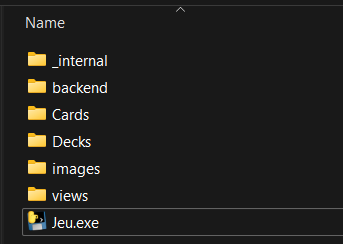

# Mange Ta Giraffe

Projet fait localement pour pouvoir jouer à Magic the Gathering entre amis, sans restrictions de cartes ni de règles.

## Installation

### Windows 
[1. Veuillez télécharger le **jeu complet**](https://send.tresorit.com/a#vzEWwSYNZuWryJ387H-CTg)

2. Décompressez le dossier à l'emplacement de votre choix, vous devriez donc avoir :
   
 

**NOTE : Vous pouvez renommer le dossier et/ou l'exécutable au(x) nom(s) de votre choix**

3. Nous recommandons de vous créer un raccourci de bureau de l'exécutable situé dans le dossier décompressé 

### Linux -----[**À LA DEMANDE**]-----

### Les images
> [!caution]
> :warning: **ATTENTION pour pouvoir utiliser les images, vous devrez :**
> 1. Télécharger les dossiers compressés;
> 2. Puis décompresser ceux-ci
> 
> **Nous tenons à vous avertir que faire tout cela sera assez long, étant donné le nombre élevé d'images**

[Lien de téléchargement pour les cartes simples](https://send.tresorit.com/a#C8rShnnrQ9TByKUcGHaaYA)  

[Lien de téléchargement pour les cartes à deux faces ainsi que les cartes tokens](https://send.tresorit.com/a#fjyBNBu1WgepQO-IBx40kw)

### Setup
1. Commencez par suivre les instructions d'**Installation** plus haut

2. Dans le dossier obtenu, crééez un nouveau dossier nommé Cards :  

  

3. Téléchargez les dossiers compressés d'images (voir **Images** plus haut) Pour chaque dossier d'images compressé, décompressez-le directement dans le dossier Cards de **2.** :  

  
  
  
  

4. Assurez vous que le dossier décompressé ne contient pas un autre sous-dossier du même nom :
   
  
  
5. Voici le contenu du dossier Cards que vous devriez avoir après ce setup :

  
