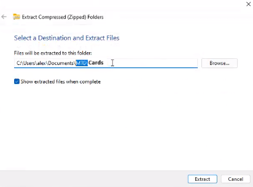

# Mange Ta Giraffe

Projet fait localement pour pouvoir jouer à Magic the Gathering entre amis, sans restrictions de cartes ni de règles.

## Installation

### Setup du jeu
[1. Veuillez télécharger le **bundle du jeu complet**](https://send.tresorit.com/a#b23OXzAYhY-b1xDumsupDw)

2. Décompressez le dossier dans un dossier de votre choix :
   

### Setup des cartes
> [!caution]
> :warning: **ATTENTION pour pouvoir utiliser les images, vous devrez :**
> 1. Télécharger les dossiers compressés;
> 2. Puis décompresser ceux-ci
> 
> **Nous tenons à vous avertir que faire tout cela sera assez long, étant donné le nombre élevé d'images**

[Lien de téléchargement pour les cartes simples](https://send.tresorit.com/a#C8rShnnrQ9TByKUcGHaaYA)  

[Lien de téléchargement pour les cartes à deux faces ainsi que les cartes tokens](https://send.tresorit.com/a#fjyBNBu1WgepQO-IBx40kw)

1. Commencez par suivre les instructions d'**Installation** plus haut

2. Dans votre dossier de jeu, créez un nouveau dossier nommé Cards :  

  

3. Téléchargez les dossiers compressés d'images (voir **Images** plus haut) Pour chaque dossier d'images compressé, décompressez-le directement dans le dossier Cards de **2.** :  

  
  
  
  

4. Assurez vous que le dossier décompressé ne contient pas un autre sous-dossier du même nom :
   
  
  
5. Voici le contenu du dossier Cards que vous devriez avoir après ce setup :

  

### Voici ce que devrait avoir l'air votre dossier de jeu apès setup (et création de deck(s))
 

### Il est très probable que vous ayez un prompt windows, c'est simplement dû au fait que nous n'avons pas "signé" le jeu :
