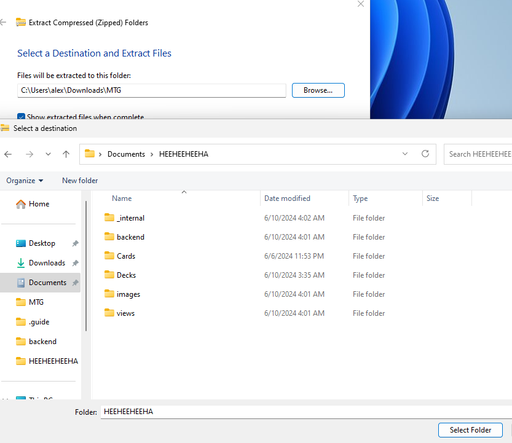

# Mange Ta Giraffe

Projet fait localement pour pouvoir jouer à Magic the Gathering entre amis, sans restrictions de cartes ni de règles.

## Installation

### Les images
> [!caution]
> :warning: **ATTENTION pour pouvoir utiliser les images, vous devrez :**
> 1. Télécharger les dossiers compressés;
> 2. Puis décompresser ceux-ci
> 
> **Nous tenons à vous avertir que faire tout cela sera assez long, étant donné le nombre élevé d'images**

[Lien de téléchargement pour les cartes simples](https://send.tresorit.com/a#qClLSz0g8ijnK5-BBRTcQA)  

[Lien de téléchargement pour les cartes doubles ainsi que les cartes tokens](https://send.tresorit.com/a#YOZLr9XQ31voRr47vw5KLA)

### Setup initial
1. Commencez par vous créer un dossier du nom de votre choix, il peut être situé n'importe où :  
   
  
  

2. Dans ce dossier, crééez un nouveau dossier nommé Cartes :  

  

3. Téléchargez les dossiers compressés d'images (voir **Images** plus haut) Pour chaque dossier d'images compressé, décompressez-le directement dans le dossier Cartes de **2.** :  

  
  
  
  

4. Assurez vous que le dossier décompressé ne contient pas un autre sous-dossier du même nom :
   
  
  
5. Voici le contenu du dossier Cartes que vous devriez avoir après ce setup :

  

### Windows [À VENIR, ENCORE EN PRÉPARATION]
1. Téléchargez le fichier d'extension .exe dans les fichiers tout en haut, et déplacez-le dans le dossier que vous avez créé en **1. de Setup initial** :  
   
2. Nous recommandons de vous créer un raccourci de bureau de cet exécutable :  

### Linux
